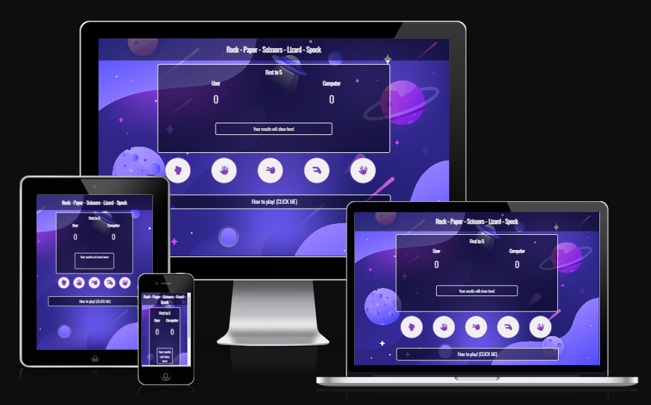

# Rock - Paper - Scissors - Lizard - Spock

Welcome to Rock - Paper - Scissors - Lizard - Spock! The rock paper scissors game with a twist, test your luck and try to beat the computer in a game of first to 5! Whats your next move?!

## Features

__Games Area__

The center focus for all outcomes within the game. fully responsive and interative 

### Round Win or Loss

- Once the user has made their choice the game clearly indicates if they have won the round giving the user an instant visual indication with a flash of green or red.

- Clear interactive message aswell as visual indication to round loss 

### Game Win or Loss

- Instant visual confirmation when the game is won, keeping consistant with the green colour and removing the buttons so they know it is over, while producing a highlighted message.

- Bold message with clear indication of losing the game, getting the user to replay and try to win!

__Icons__

- Interactive buttons allowing the user to chose whichever move they want to make. Changes colour, enlarges and cursor changes to pointer when hovered increasing the visual indication of which button the user is currently over.

__Rules__

- If the user is unsure on how to play or what beats what a clear button has been added for this very case. To make it clear to the user that this is a interactive button i added "(CLICK ME)" to its content and changed the mouse to pointer when hovered.

- Once Clicked instructions are clearly laid out in a easy to read fashion.

