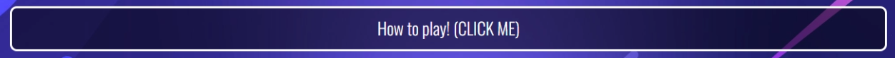

Rock - Paper - Scissors - Lizard - Spock

Welcome to Rock - Paper - Scissors - Lizard - Spock! The rock paper scissors game with a twist, test your luck and try to beat the computer in a game of first to 5! Whats your next move?!

[You can view the site live here!](https://cjfinan.github.io/Rock-Paper-Scissors-Lizard-Spock/)

## Features

__Games Area__

The center focus for all outcomes within the game. fully responsive and interative 

### Round Win or Loss

- Once the user has made their choice the game clearly indicates if they have won the round giving the user an instant visual indication with a flash of green or red.

- Clear interactive message aswell as visual indication to round loss 

### Game Win or Loss

- Instant visual confirmation when the game is won, keeping consistant with the green colour and removing the buttons so they know it is over, while producing a highlighted message.

- Bold message with clear indication of losing the game, getting the user to replay and try to win!

__Icons__

- Interactive buttons allowing the user to chose whichever move they want to make. Changes colour, enlarges and cursor changes to pointer when hovered increasing the visual indication of which button the user is currently over.

__Rules__

- If the user is unsure on how to play or what beats what a clear button has been added for this very case. To make it clear to the user that this is a interactive button i added "(CLICK ME)" to its content and changed the mouse to pointer when hovered.

- Once Clicked instructions are clearly laid out in a easy to read fashion.

## Testing

__Validation Testing__

- Developer tools where used to check the sites responsiveness for a range of different potential screen sizes

- No errors were returned when passing it through the official [W3C validator](https://validator.w3.org/#validate_by_input)
- No errors were returned when passing it through the official [W3C CSS Validation](https://jigsaw.w3.org/css-validator/)
- No errors were returned when passing it through [JSHint JavaScript Validator](https://jshint.com/)

__Lighthouse__ 

- Lighthouse was used through chrome dev tools to analyse for the following 
 - Performace
 - Acessibility
 - Best practice
 - SEO

 This was done for desktop 

 

  __Further Testing__

  Testing was carried out using Chrome, Microsoft edge and firefox

 Responsiveness was test through google chromes dev tools on a number of devices that include;
  - Iphone 12 Pro
  - Iphone SE
  - Ipad
  - Ipad Air
  - Ipad Mini
  - Pixel 5
  - Galaxy S8+
  - Surface Duo

  ## Deployment

  The site was deployed to GitHub pages. The steps to deploy are as follows:
  - In the GitHub repository, navigate to the Settings tab
  - From the source section drop-down menu, select the Master Branch
  - Once the master branch has been selected, the page will be automatically refreshed with a detailed ribbon display to indicate the successful deployment.

  
  ## Techonologies Used

  HTML5
  CSS3
  JavaScript
  Balsamiq
   
   ## Issues / Bugs

  1) Switch statement 
     - incorrect syntax to allow for two conditions within the same if statement
      - Before - if (randomAnswer === "lizard" || randomAnswer === "scissors")
      - Fixed - if ((randomAnswer === "lizard") || (randomAnswer === "scissors"))

  2) UserChoice function
     - Originally i had a UserChoice function but i encountered a problem where i could not access the users choice from another function so to get around this i removed the function all together and made it global.

  3) Typos
     - When proof reading through the website typos were corrected

  ## Credits

 ### Content
  - The icons within the wbesite were taken from [Font Awesome](https://fontawesome.com/)
  - [w3schools](https://www.w3schools.com/) was used to refresh myself on certain topics and learn new ones
